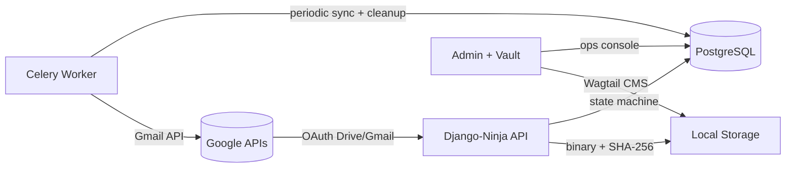
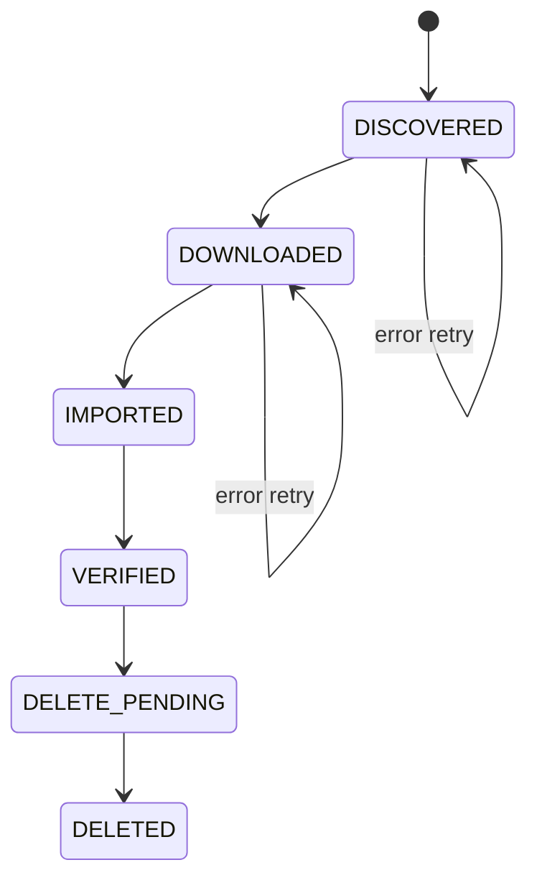
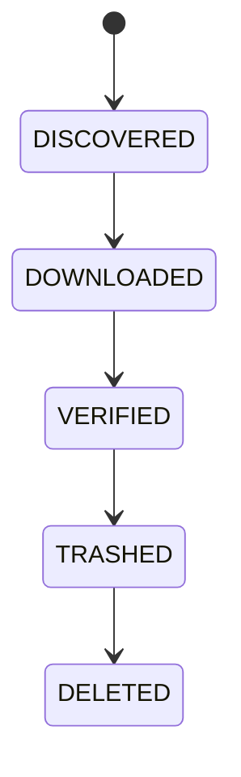
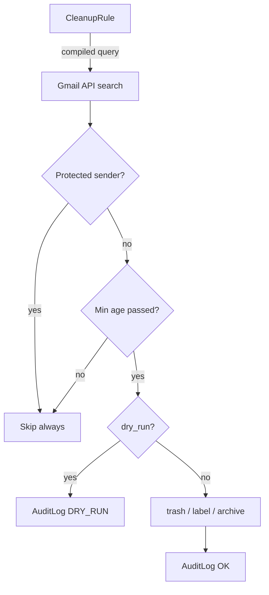

# BackDeezUp

Self-hosted platform for backing up **Google Drive**, **Google Photos**, and **Gmail** to local storage — with intelligent cleanup rules, an immutable audit trail, a two-proof deletion guard, and a Wagtail media vault.

[](https://www.python.org/)
[](https://www.djangoproject.com/)
[](LICENSE)

---

## What it does



### Drive / Photos pipeline



**Two proofs required before any Drive deletion:**
1. Local file exists on disk at `download_path`
2. `MediaItem` record exists in the database (SHA-256 keyed)

### Gmail pipeline



Gmail messages stored as `.eml` files at `media/gmail/<account>/<year>/<month>/<id>.eml`.
EXIF metadata stripped from attachments before storage — GPS/device data preserved in `MediaMetadata` table.

### Gmail cleanup rules



---

## Apps

| App | Models | Purpose |
|---|---|---|
| `google_media_backup` | DriveAsset, MediaItem, RunLog | Drive + Photos backup pipeline |
| `google_gmail_backup` | GmailMessage, GmailAttachment, CleanupRule, RuleCondition, ProtectedSender, CleanupAuditLog | Gmail backup + cleanup engine |
| `media_vault` | VaultImage, VaultMedia, VaultDocument, MediaDecision, MediaMetadata, GalleryIndexPage | Wagtail 7.4 media browser + EXIF strip |
| `accounts` | BackupUser | Custom user model |
| `core` | — | Landing page, HTMX stats |

---

## Infrastructure

| Service | Purpose |
|---|---|
| `web` | Gunicorn — Django + Ninja API |
| `nginx` | TLS termination, static files, protected media |
| `db` | PostgreSQL 16 |
| `redis` | Celery broker + rate-limit cache |
| `celery` | Background task worker (2 concurrent) |
| `celerybeat` | Periodic task scheduler (database-backed) |

---

## Quick start

### Prerequisites
- Docker + Docker Compose
- Google Cloud project with OAuth Desktop app client (`installed` type)

### Deploy

```bash
# 1. Clone
git clone git@github-dev:devadalberto/backdeezup.git
cd backdeezup

# 2. Configure
cp .env.sample .env
# Fill all CHANGE_ME values — SECRET_KEY, DB password, Redis password, Fernet key
# Generate Django secret key:
python3 -c "import secrets; print(secrets.token_urlsafe(50))"
# Generate Fernet key (must be exactly 44 chars, base64url-encoded 32 bytes):
python3 -c "import base64,os; print(base64.urlsafe_b64encode(os.urandom(32)).decode())"

# 3. Generate TLS certs (self-signed for localhost dev)
make gen-certs
# To trust the cert in Windows: run as Administrator:
# certutil -addstore -f "ROOT" nginx/certs/server.crt

# 4. Place Google OAuth credentials (Desktop app / installed type)
cp '/mnt/c/Users/.../Downloads/client_secret_*_(1).json' secrets/google_client.json
python3 -c "import json; d=json.load(open('secrets/google_client.json')); print(list(d.keys())[0])"
# Must print: installed

# 5. Pre-flight
make preflight

# 6. Build + start (6 containers)
make build && make up && make migrate && make superuser

# 7. Authenticate with Google
make auth

# 8. Seed rules + apply protected senders
make seed-rules
```

### Access
- **HTTPS**: `https://localhost:8445` (recommended)
- **HTTP**: `http://localhost:8844` → redirects to HTTPS

### Running pipelines

```bash
# Gmail — full discovery + concurrent download
make gmail-discover
make gmail-loop LIMIT=500 WORKERS=10

# Drive
make discover
make sync-run LIMIT=100

# Extract family photo/video attachments
make gmail-extract-attachments-dry   # count first
make gmail-extract-attachments       # extract
make import-media ARGS="--source gmail"  # push to vault

# Check progress
make gmail-progress
make progress
```

### Enable periodic automation (Celery Beat)

Celery Beat runs automatically when the `celerybeat` container is up.
The schedule is in `/admin/django_celery_beat/periodictask/` — editable in the admin.

Default schedule (from `celery_app.py`):
- Gmail incremental sync: every 6 hours
- Apply protected sender rules: every 6 hours (offset 30min)
- Run all enabled cleanup rules: 06:00, 12:00, 18:00 daily

Monitor workers:
```bash
make celery-logs      # tail worker + beat output
make celery-status    # inspect active tasks
```

---

## Admin UI

| URL | Purpose |
|---|---|
| `/` | Landing page with live pipeline stats |
| `/admin/` | Django Admin (Matrix + Amber dark theme) |
| `/admin/gmail/dashboard/` | Gmail backup progress bar (auto-refresh) |
| `/admin/gmail/ops/` | Gmail ops — pipeline, cleanup rules, empty trash |
| `/admin/gmail/rule-builder/` | Compound cleanup rule builder |
| `/admin/ops/` | Drive ops console |
| `/admin/vault/ops/` | Media Vault — import + review |
| `/vault/gallery/` | Stash-style gallery (thumbnail grid, filters, video streaming) |
| `/vault/review/` | Media triage UI (K/D/S/Z keyboard) |
| `/cms/` | Wagtail CMS |
| `/admin/django_celery_beat/` | Edit periodic task schedule |
| `/admin/django_celery_results/` | View task history + results |

---

## Key make targets

```
make preflight                         Check Docker, .env, google_client.json
make build                             Build Docker image
make up / down                         Start / stop containers
make redeploy                          git pull + build + restart + migrate
make gen-certs                         Generate self-signed TLS cert (run once)
make auth                              Google OAuth (headless, Desktop app)
make migrate                           Run Django migrations
make seed-rules                        Seed/update cleanup rules (idempotent)
make vault-setup                       Create Wagtail VaultHomePage (once)
make gmail-discover                    Discover all Gmail message IDs
make gmail-download                    Download .eml files (LIMIT, WORKERS)
make gmail-verify                      Verify .eml files on disk
make gmail-loop                        Loop download+verify until queue empty
make gmail-extract-attachments         Extract images/videos from .eml files
make gmail-extract-attachments-dry     Count attachments before extracting
make gmail-progress                    Show backup progress JSON
make discover                          Discover Drive media
make sync-run                          Drive pipeline loop
make celery-logs                       Tail Celery worker + beat logs
make celery-status                     Inspect active Celery tasks
make test-full                         lint + 59 tests
make logs                              Tail all container logs
make ps                                Show container status
```

---

## Configuration

| Variable | Required | Notes |
|---|---|---|
| `DJANGO_SECRET_KEY` | prod | 50-char random string |
| `GOOGLE_ENCRYPTION_KEY` | **yes** | 44-char base64url Fernet key — never lose |
| `GOOGLE_CLIENT_SECRETS` | **yes** | Path to OAuth client JSON (`installed` type) |
| `DATABASE_URL` | prod | `postgres://user:pass@db:5432/dbname` |
| `REDIS_PASSWORD` | **yes** | Redis auth password |
| `REDIS_URL` | auto | `redis://:PASSWORD@redis:6379/0` |
| `SENTRY_DSN` | no | Leave blank to disable error tracking |
| `DRIVE_DELETE_MODE` | no | `trash` (default) or `hard` |
| `MIN_RETENTION_DAYS` | no | Days before commit-delete fires (default: 3) |

---

## OAuth scopes

All scopes requested at `make auth`. Delete `secrets/google_token.json` and re-run if any scope is missing.

| Scope | Used for |
|---|---|
| `drive` + `drive.readonly` | Drive file listing + download |
| `gmail.readonly` + `gmail.modify` | Gmail read + cleanup rules |
| `https://mail.google.com/` | `batchDelete` — permanent trash deletion |
| `photoslibrary.readonly` | Photos (de-scoped — blocked by old web client `1ql0o9aj`) |

---

## Project structure

```
backdeezup/
├── backend_django/
│   ├── celery_app.py                  Celery app + beat schedule
│   ├── config/
│   │   ├── settings.py                Celery, Sentry, Redis, security config
│   │   └── urls.py                    routing
│   ├── google_media_backup/           Drive + Photos pipeline
│   │   ├── models.py                  DriveAsset, MediaItem, RunLog (TextChoices)
│   │   ├── api.py                     Ninja endpoints
│   │   └── services_google.py         OAuth (atomic token write, 0o600 perms)
│   ├── google_gmail_backup/           Gmail pipeline + cleanup
│   │   ├── models.py                  GmailMessage, CleanupRule, AuditLog (TextChoices)
│   │   ├── tasks.py                   Celery tasks (replaces APScheduler)
│   │   ├── services_gmail.py          Gmail API wrappers
│   │   ├── services_rules.py          Cleanup rule engine (select_for_update)
│   │   └── management/commands/       gmail_pipeline (concurrent), extract_attachments
│   ├── media_vault/                   Wagtail media vault
│   │   ├── models.py                  VaultImage, VaultMedia, MediaMetadata
│   │   ├── exif_strip.py              EXIF preservation + strip before storage
│   │   ├── api.py                     Vault API + import + streaming
│   │   └── views.py                   Gallery, review UI, HTTP Range video streaming
│   └── templates/admin/               Matrix + Amber dark theme (4 themes + HUD switcher)
├── nginx/
│   ├── nginx.conf                     TLS, HTTP→HTTPS redirect, security headers
│   └── certs/                         TLS certs (git-ignored, run make gen-certs)
├── scripts/
│   └── gen-dev-certs.sh               Self-signed cert generator
├── secrets/                           OAuth credentials (git-ignored)
├── docker-compose.yml                 6 services: web+nginx+db+redis+celery+celerybeat
├── pyproject.toml                     uv / PEP 621
├── Makefile                           All operations
├── shared_context.md                  AI agent ground truth
└── graphify-out/                      Knowledge graph (run: graphify update .)
```

---

## Security notes

- OAuth token written atomically (`mkstemp + os.replace`), permissions `0o600`
- Fernet key validated as real base64url 32-byte key at startup
- All media files served through Django (nginx `internal` location — not directly accessible)
- `select_for_update(skip_locked=True)` on cleanup rule execution — no double-trash
- EXIF stripped from all images before vault storage — GPS/device data in `MediaMetadata` only
- Rate limits on all destructive endpoints (`@ratelimit`)
- All API endpoints require `auth=django_auth`

---

## AI agent collaboration

All AI agents (Claude, Gemini, Codex) share:
- **`shared_context.md`** — single source of truth; update after every material change
- **`graphify-out/`** — knowledge graph; run `graphify update .` after code changes
- Install graphify: `uv tool install graphifyy`

---

## Testing

```bash
make test-full     # ruff lint + 59 tests
```

---

## Acknowledgements

- [Django](https://www.djangoproject.com/) + [Django Ninja](https://django-ninja.dev/)
- [Wagtail](https://wagtail.org/) 7.4 LTS
- [Celery](https://docs.celeryq.dev/) + [django-celery-beat](https://django-celery-beat.readthedocs.io/)
- [Google APIs Python Client](https://github.com/googleapis/google-api-python-client)
- [uv](https://docs.astral.sh/uv/) by Astral
- [Sentry](https://sentry.io/) for error tracking
