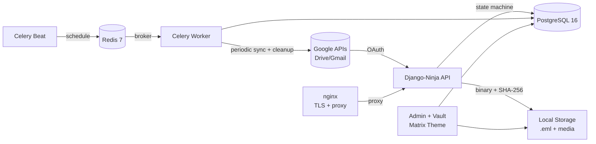
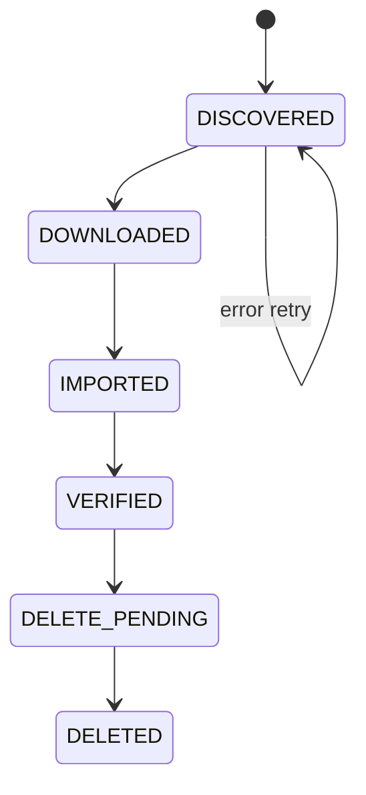
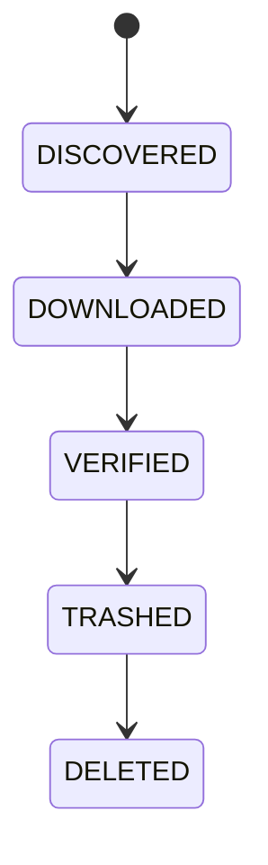
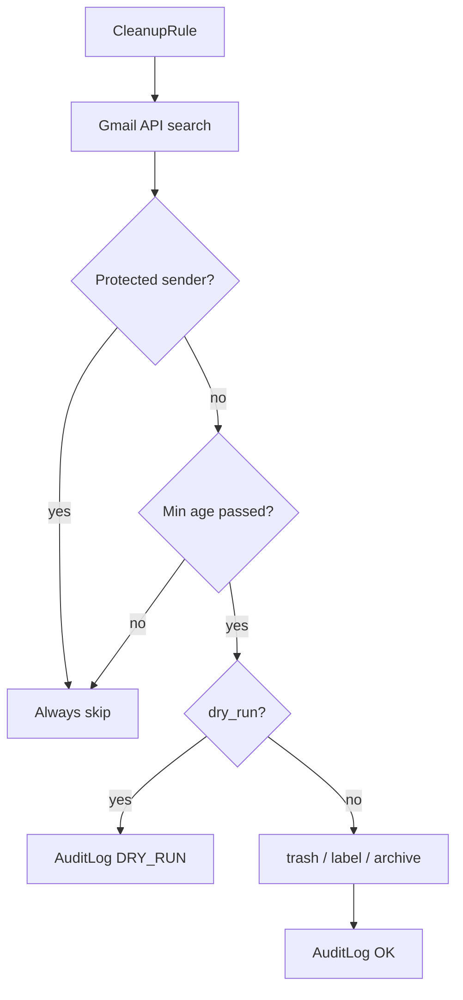
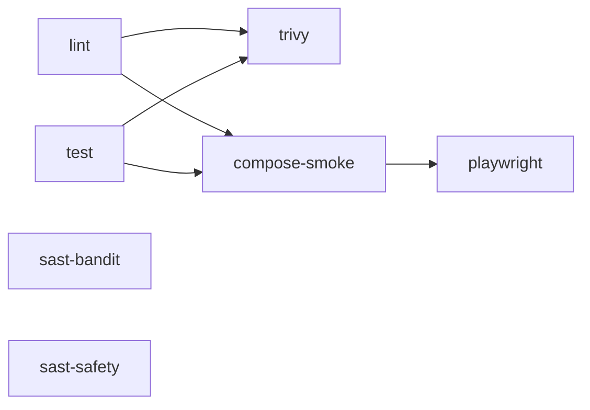

# BackDeezUp

Self-hosted platform for backing up **Google Drive**, **Google Photos**, and **Gmail** with intelligent cleanup rules, an immutable audit trail, a two-proof deletion guard, a Wagtail media vault, and a Stash-style gallery.

[](https://www.python.org/)
[](https://www.djangoproject.com/)
[](https://docs.celeryq.dev/)
[](LICENSE)

---

## Architecture



### 6-container Docker stack

| Container | Image | Purpose |
|---|---|---|
| `web` | backdeezup-web | Gunicorn — Django + Ninja API |
| `nginx` | nginx:stable-alpine | TLS termination, static files, protected media |
| `db` | postgres:16 | Primary database |
| `redis` | redis:7-alpine | Celery broker + rate-limit cache |
| `celery` | backdeezup-web | Background task worker (2 concurrent) |
| `celerybeat` | backdeezup-web | Periodic task scheduler |

---

## Pipeline diagrams

### Drive / Photos



**Two proofs required before deletion:** file on disk + `MediaItem` SHA-256 in DB.

### Gmail



### Gmail cleanup rules



---

## Quick start

### Prerequisites
- Docker + Docker Compose  
- Google Cloud project with OAuth **Desktop app** client (`installed` type)

### 1 — Clone and configure

```bash
git clone git@github-dev:devadalberto/backdeezup.git
cd backdeezup
cp .env.sample .env
```

Edit `.env` and fill every `CHANGE_ME` value:

```bash
# Generate Django secret key
python3 -c "import secrets; print(secrets.token_urlsafe(50))"

# Generate Fernet key (exactly 44 chars, base64url 32 bytes)
python3 -c "import base64,os; print(base64.urlsafe_b64encode(os.urandom(32)).decode())"
```

### 2 — Google OAuth credentials

```bash
# Download Desktop app credentials from Google Cloud Console
# Must be type 'installed' — NOT 'web'
cp '/mnt/c/Users/Administrator/Downloads/client_secret_*_(1).json' \
   secrets/google_client.json

# Verify type (must print 'installed')
python3 -c "import json; d=json.load(open('secrets/google_client.json')); print(list(d.keys())[0])"
```

### 3 — TLS certificates (localhost/dev)

```bash
make gen-certs
# Generates nginx/certs/server.crt and server.key (git-ignored)

# Trust the cert on Windows (run PowerShell as Administrator):
certutil -addstore -f "ROOT" nginx/certs/server.crt
# Restart Chrome/Edge after importing
```

### 4 — Pre-flight check

```bash
make preflight
# Checks: Docker running, .env present, no CHANGE_ME, google_client.json is 'installed' type
```

### 5 — Build and start

```bash
make build && make up && make migrate && make superuser
```

### 6 — Authenticate with Google

```bash
make auth
# Prints OAuth URL → open in browser → page fails to load (expected)
# Copy the FULL URL from address bar → paste back into terminal
```

### 7 — Seed rules and run initial setup

```bash
make seed-rules        # seed 15 cleanup rules with correct thresholds
make seed-inbox-rules  # seed 12 inbox-specific rules (banking, social, etc.)
make vault-setup       # create Wagtail VaultHomePage (run once)
```

---

## Access

| URL | Purpose |
|---|---|
| `https://localhost:8445` | Main entry point (TLS) |
| `http://localhost:8844` | Redirects to HTTPS |
| `/` | Landing page (live stats) |
| `/admin/` | Django Admin (Matrix + Amber theme) |
| `/admin/gmail/dashboard/` | Gmail backup progress (auto-refreshes) |
| `/admin/gmail/ops/` | Gmail ops — pipeline, rules, empty trash |
| `/admin/gmail/rule-builder/` | Compound rule builder |
| `/admin/ops/` | Drive ops console |
| `/admin/vault/ops/` | Media Vault ops — import + review |
| `/vault/gallery/` | Stash-style gallery (thumbnails, filters, video) |
| `/vault/review/` | Triage UI — K=keep D=delete S=skip Z=undo |
| `/cms/` | Wagtail CMS |
| `/admin/django_celery_beat/` | Edit periodic task schedule |
| `/admin/django_celery_results/` | View task history |
| `/api/docs` | Drive API (Swagger) |
| `/api/gmail/docs` | Gmail API (Swagger) |
| `/api/vault/docs` | Vault API (Swagger) |

---

## Operations manual

### Gmail backup

```bash
# Full discovery (finds all message IDs)
make gmail-discover

# Download + verify in a loop until done (runs until DISCOVERED queue = 0)
make gmail-loop LIMIT=500 WORKERS=10

# Check progress at any time
make gmail-progress
# or visit /admin/gmail/dashboard/

# Extract family photos/videos from .eml files
make gmail-extract-attachments-dry   # count only — safe to run
make gmail-extract-attachments       # extract (JPEG/PNG/video → media/gmail/attachments/)

# Push extracted attachments to Wagtail vault
make import-media ARGS="--source gmail"
```

### Drive backup

```bash
make discover           # discover Drive media (images/videos)
make discover-files     # discover Drive documents (PDF, Office, etc.)
make sync-run LIMIT=100 # download → import → verify loop
make progress           # show Drive pipeline progress
```

### Gmail cleanup rules

```bash
# Re-seed rules (idempotent — safe to run anytime, updates thresholds)
make seed-rules          # core 15 rules (5d/15d thresholds)
make seed-inbox-rules    # 12 inbox-specific rules

# Apply protected sender rules (star + label family emails)
# From /admin/gmail/ops/ → Protected Senders → Apply button
# Or: curl -X POST https://localhost:8445/api/gmail/protected-senders/apply

# Execute all enabled rules (web UI recommended)
# /admin/gmail/ops/ → Dry-run All Enabled Rules → review → Execute All
```

**Rule thresholds:**

| Category | Min age | Action |
|---|---|---|
| Promotions, Social, Updates | 5 days | trash |
| Forums, No-reply, Mailing lists | 15 days | trash |
| Newsletters (unsubscribe) | 5 days | trash |
| Spam folder | 0 days | trash |
| LinkedIn non-job | 5 days | trash |
| Marketing platforms | 5 days | trash |
| E-commerce confirmations | 90 days | archive |
| Banking/financial | 0 days | archive |
| Job board alerts | 0 days | label: work/jobs |

### Empty Gmail trash

From `/admin/gmail/ops/` → **Empty Gmail Trash** section:
1. Click **Dry-run** to count trash messages
2. Click **Force Empty Trash (skip guard)** → confirm → done

Requires ≥90% backup to execute via the standard button. Force button bypasses the guard.

### Celery (background jobs)

```bash
make celery-logs      # tail worker + beat logs
make celery-status    # inspect active tasks
make celery-purge     # clear task queue (use carefully)
```

Periodic tasks (editable at `/admin/django_celery_beat/periodictask/`):
- **Gmail incremental sync** — every 6h (picks up new messages)
- **Apply protected senders** — every 6h + 30min
- **Run cleanup rules** — 06:00, 12:00, 18:00 daily

### Media vault

```bash
# Import Drive + Gmail media into Wagtail vault
make import-media                         # all sources
make import-media ARGS="--source drive"   # Drive only
make import-media ARGS="--source gmail"   # Gmail only
make import-media ARGS="--dry-run"        # count without importing

# From web: /admin/vault/ops/ → Import Pipeline → Dry-run → Run Import
# Browse: /vault/gallery/
# Triage: /vault/review/ (K/D/S/Z keyboard shortcuts)
```

### Maintenance

```bash
make redeploy         # git pull + rebuild + restart + migrate (standard upgrade)
make migrate          # run migrations only
make seed-rules       # re-seed/update cleanup rules
make test-full        # lint + 59 unit tests (run before every PR)
make logs             # tail all container logs
make ps               # show container status
make preflight        # pre-flight checks
```

---

## Autostart on VM boot

### How it works

```
WINWEB01 boots
  → Windows login
  → Startup folder runs backdeezup-autostart.bat
  → wsl -d Debian starts
  → systemd boots
  → backdeezup.service starts
  → docker compose up -d
  → all 6 containers running
```

### Setup (already installed on WINWEB01)

**Windows startup bat** — already in `%APPDATA%\Microsoft\Windows\Start Menu\Programs\Startup\`:
```
scripts/windows-autostart.bat
```
Logs to `%TEMP%\backdeezup-autostart.log`.

**Debian systemd service** — already installed and enabled:
```bash
sudo bash scripts/autostart.sh    # re-install if needed
systemctl status backdeezup.service
```

---

## CI/CD pipeline (GitHub Actions)

Every push and PR to `main` runs 7 stages — all containerized:



| Stage | Tool | Output |
|---|---|---|
| `lint` | ruff in `python:3.12-slim` | PR gate |
| `test` | Django tests in `python:3.12-slim` | PR gate |
| `sast-bandit` | Bandit Python SAST | → GitHub Security tab (SARIF) |
| `sast-safety` | Safety dep CVE scan | → Artifact |
| `trivy` | Trivy container CVE scan | → GitHub Security tab (SARIF) |
| `compose-smoke` | Full 6-container stack + HTTPS smoke | PR gate |
| `playwright` | Chromium E2E (admin + API docs) | PR gate |

Security findings: **Security → Code scanning** on GitHub.

---

## Configuration reference

| Variable | Required | Description |
|---|---|---|
| `DJANGO_SECRET_KEY` | **yes** | 50-char random string |
| `GOOGLE_ENCRYPTION_KEY` | **yes** | 44-char base64url Fernet key |
| `GOOGLE_CLIENT_SECRETS` | **yes** | Path to OAuth JSON (`installed` type) |
| `DATABASE_URL` | prod | `postgres://user:pass@db:5432/dbname` |
| `REDIS_PASSWORD` | **yes** | Redis auth password |
| `REDIS_URL` | auto | `redis://:PASSWORD@redis:6379/0` |
| `SENTRY_DSN` | no | Blank = disabled |
| `SENTRY_ENVIRONMENT` | no | Default: `production` |
| `DRIVE_DELETE_MODE` | no | `trash` (default) or `hard` |
| `MIN_RETENTION_DAYS` | no | Days before commit-delete (default: 3) |
| `MEDIA_ROOT` | no | Where files land (default: `/app/media`) |

---

## Make targets reference

```
# Setup
make preflight                     Check prerequisites
make build                         Build Docker image
make gen-certs                     Generate self-signed TLS cert
make up / down / restart           Start / stop / restart containers
make redeploy                      git pull + build + restart + migrate
make migrate                       Run migrations only
make superuser                     Create admin user
make auth                          Google OAuth flow

# Seeding
make seed-rules                    Seed/update 15 core cleanup rules
make seed-inbox-rules              Seed/update 12 inbox-specific rules
make vault-setup                   Create Wagtail VaultHomePage (once)

# Gmail pipeline
make gmail-discover                Discover all Gmail message IDs (50 pages)
make gmail-download                Download .eml files (LIMIT, WORKERS)
make gmail-verify                  Verify .eml files on disk
make gmail-loop LIMIT=N WORKERS=N  Loop download+verify until queue empty
make gmail-run                     Single download+verify pass
make gmail-progress                Show backup progress JSON
make gmail-extract-attachments-dry Count attachments before extracting
make gmail-extract-attachments     Extract images/videos from .eml files
make gmail-extract-all             Extract from ALL messages (not just family)

# Gmail trash
make gmail-empty-trash-dry         Show trash count (no deletion)
make gmail-empty-trash             Empty trash (requires --confirm)

# Drive pipeline
make discover                      Discover Drive media
make discover-files                Discover Drive documents
make discover-photos               Discover Google Photos (currently blocked)
make sync-run LIMIT=N              Drive download→import→verify loop
make progress                      Drive pipeline progress

# Media vault
make import-media                  Import Drive+Gmail media → vault
make import-media ARGS="--dry-run" Count importable items

# Celery
make celery-logs                   Tail worker + beat logs
make celery-status                 Inspect active tasks
make celery-purge                  Clear task queue

# Development
make shell                         Django shell inside container
make check                         Django system check
make test-full                     lint + 59 unit tests
make logs                          Tail all container logs
make ps                            Show container status
```

---

## OAuth scopes

All requested at `make auth`. Delete `secrets/google_token.json` and re-run if any scope is missing.

| Scope | Used for |
|---|---|
| `drive` + `drive.readonly` | Drive listing + download |
| `gmail.readonly` + `gmail.modify` | Gmail read + cleanup rules |
| `https://mail.google.com/` | `batchDelete` — permanent deletion |
| `photoslibrary.readonly` | Photos — **DE-SCOPED** (blocked by old web client `1ql0o9aj`) |

**Photos unblock:** delete client `1ql0o9aj` from Google Auth Platform → Clients → `make auth`.

---

## Security notes

- OAuth token written atomically (`mkstemp + os.replace`), permissions `0o600`  
- Fernet key validated as real base64url 32-byte key at startup — rejects placeholders  
- All media files served through Django (`nginx internal` — not directly accessible)  
- `select_for_update(skip_locked=True)` on cleanup rules — prevents double-trash  
- EXIF stripped from all images before vault storage (GPS, device info in `MediaMetadata` only)  
- Rate limits on all destructive endpoints  
- All API endpoints require `auth=django_auth`  
- HTTPS enforced — HTTP redirects to HTTPS  
- Redis password-protected  
- 2FA enabled on GitHub account  

---

## Project structure

```
backdeezup/
├── .github/workflows/
│   ├── ci.yml                  7-stage CI (lint+test+SAST+Trivy+smoke+E2E)
│   └── gh-pages.yml            Docs build
├── backend_django/
│   ├── celery_app.py           Celery app + beat schedule
│   ├── config/
│   │   ├── settings.py         Celery, Sentry, Redis, security config
│   │   └── urls.py             URL routing
│   ├── google_media_backup/    Drive + Photos pipeline
│   │   ├── models.py           DriveAsset, MediaItem, RunLog (TextChoices + indexes)
│   │   ├── api.py              Ninja endpoints
│   │   ├── services_google.py  OAuth (atomic write, 0o600 perms)
│   │   └── management/commands/drive_pipeline.py
│   ├── google_gmail_backup/    Gmail pipeline + cleanup engine
│   │   ├── models.py           GmailMessage, CleanupRule, AuditLog (TextChoices)
│   │   ├── tasks.py            Celery tasks (replaces APScheduler)
│   │   ├── services_gmail.py   Gmail API wrappers
│   │   ├── services_rules.py   Cleanup engine (select_for_update)
│   │   ├── admin_views.py      Ops console views
│   │   ├── htmx_views.py       HTMX partials (progress, audit log)
│   │   └── management/commands/
│   │       ├── gmail_pipeline.py        Concurrent downloader
│   │       ├── extract_attachments.py   EXIF strip + save
│   │       ├── seed_rules.py            Core cleanup rules
│   │       └── seed_inbox_rules.py      Inbox-specific rules
│   ├── media_vault/            Wagtail media vault + gallery
│   │   ├── models.py           VaultImage, VaultMedia, MediaMetadata
│   │   ├── exif_strip.py       EXIF preservation + strip
│   │   ├── api.py              Vault API + import + streaming
│   │   ├── views.py            Gallery, review UI, HTTP Range video
│   │   └── pages.py            GalleryIndexPage Wagtail page type
│   ├── accounts/               BackupUser (AbstractUser)
│   ├── core/                   Landing page + HTMX stats
│   └── templates/admin/        Matrix + Amber dark theme (4 themes)
├── nginx/
│   ├── nginx.conf              TLS, HTTP→HTTPS redirect, security headers
│   └── certs/                  TLS certs (git-ignored — run make gen-certs)
├── scripts/
│   ├── gen-dev-certs.sh        Self-signed cert generator
│   ├── autostart.sh            Install Debian systemd service
│   └── windows-autostart.bat  Windows Startup folder launcher
├── secrets/                    OAuth credentials (git-ignored)
├── docker-compose.yml          6-service stack
├── pyproject.toml              uv / PEP 621 + all dependencies
├── Makefile                    All operations
├── shared_context.md           AI agent ground truth
└── graphify-out/               Knowledge graph (graphify update .)
```

---

## Troubleshooting

| Symptom | Check | Fix |
|---|---|---|
| Stack won't start after reboot | `docker compose ps` | `make up` |
| Gmail 403 / token expired | `docker compose logs --tail=20 web \| grep 403` | `rm secrets/google_token.json && make auth` |
| Cleanup rules ran but 0 affected | Check audit log at `/admin/google_gmail_backup/cleanupauditlog/` | Rule's `gmail_query` may not match — rebuild via rule builder |
| Celery tasks not running | `make celery-status` | `docker compose restart celery celerybeat` |
| TLS cert not trusted | Browser shows NET::ERR_CERT_AUTHORITY_INVALID | `make gen-certs` then install to OS trust store |
| CSRF 403 on login | New hostname/port not in CSRF_TRUSTED_ORIGINS | Add `https://<host>:<port>` to `CSRF_TRUSTED_ORIGINS` in `.env`, then `make up` |
| Progress bar stuck at "Loading..." | HTMX library not loading | Hard refresh (`Ctrl+Shift+R`) |

---

## Acknowledgements

[Django](https://www.djangoproject.com/) · [Django Ninja](https://django-ninja.dev/) · [Wagtail](https://wagtail.org/) 7.4 · [Celery](https://docs.celeryq.dev/) · [Google APIs Python Client](https://github.com/googleapis/google-api-python-client) · [uv](https://docs.astral.sh/uv/) · [Sentry](https://sentry.io/) · [Trivy](https://trivy.dev/) · [Bandit](https://bandit.readthedocs.io/)
