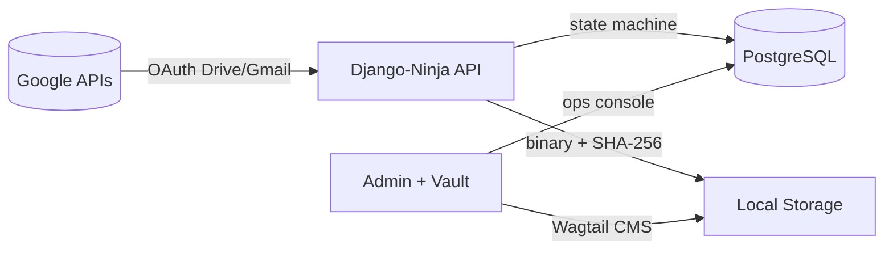
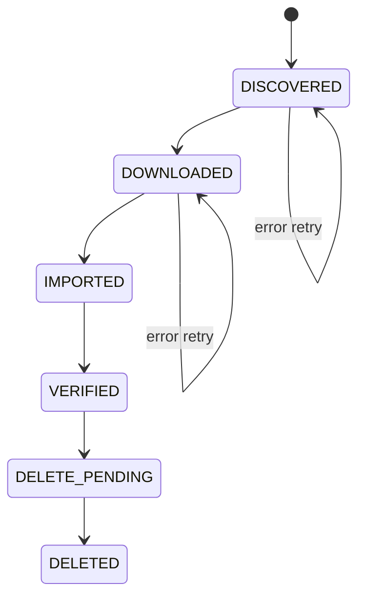
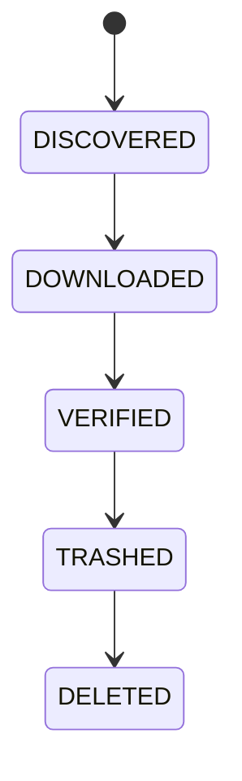
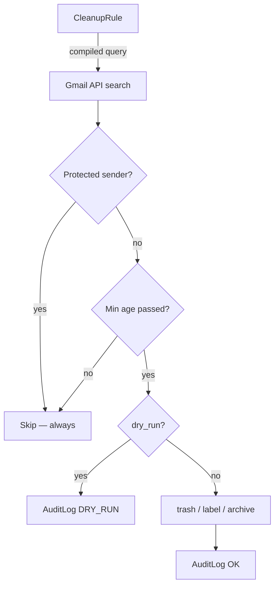

# BackDeezUp

Self-hosted platform for backing up **Google Drive**, **Google Photos**, and **Gmail** to local storage — with intelligent cleanup rules, an immutable audit trail, a two-proof deletion guard, and a Wagtail media vault.

[](https://www.python.org/)
[](https://www.djangoproject.com/)
[](LICENSE)

---

## What it does



### Drive / Photos pipeline



**Two proofs required before any Drive deletion:**
1. Local file exists on disk at `download_path`
2. `MediaItem` record exists in the database (SHA-256 keyed)

### Gmail pipeline



Gmail messages are stored as `.eml` files at `media/gmail/<account>/<year>/<month>/<id>.eml`.

### Gmail cleanup rules



---

## Apps

| App | Models | Purpose |
|---|---|---|
| `google_media_backup` | DriveAsset, MediaItem, RunLog | Drive + Photos backup pipeline |
| `google_gmail_backup` | GmailMessage, CleanupRule, RuleCondition, ProtectedSender, CleanupAuditLog | Gmail backup + cleanup engine |
| `media_vault` | VaultImage, VaultMedia, VaultDocument, MediaDecision | Wagtail 7.4 media browser + triage |
| `accounts` | BackupUser | Custom user model |
| `core` | — | Landing page, HTMX stats |

---

## Pipeline status (2026-05-17)

| Pipeline | Status |
|---|---|
| Drive | 2,176 / 2,176 verified — **COMPLETE** |
| Gmail | 25,000 / 32,258 verified — 78% (in progress) |
| Photos | BLOCKED — delete old web client `1ql0o9aj` from Google Auth Platform → Clients |

---

## Quick start

### Prerequisites

- Docker + Docker Compose
- Google Cloud project with OAuth Desktop app client (`installed` type)
- 2+ GB free disk per 10k emails

### Deploy

```bash
# 1. Clone
git clone git@github-dev:devadalberto/backdeezup.git
cd backdeezup

# 2. Configure
cp .env.sample .env
# Edit .env — fill all CHANGE_ME values
# Generate Django secret key:
python3 -c "import secrets; print(secrets.token_urlsafe(50))"
# Generate Fernet key:
python3 -c "import base64, os; print(base64.urlsafe_b64encode(os.urandom(32)).decode())"

# 3. Google OAuth credentials — must be Desktop app (installed) type
cp '/mnt/c/Users/.../Downloads/client_secret_*_(1).json' secrets/google_client.json
# Verify type (must print 'installed'):
python3 -c "import json; d=json.load(open('secrets/google_client.json')); print(list(d.keys())[0])"

# 4. Pre-flight
make preflight

# 5. Build + start
make build && make up && make migrate && make superuser

# 6. Authenticate with Google (opens browser URL)
make auth

# 7. Seed rules + apply protected senders
make seed-rules
```

### Running pipelines

```bash
# Gmail — full discovery + download loop
make gmail-discover                    # discover all message IDs
make gmail-loop LIMIT=500 WORKERS=10  # download + verify concurrently

# Drive
make discover                          # discover Drive media
make sync-run LIMIT=100               # download → import → verify loop

# Check progress
make gmail-progress
make progress
```

### Enable scheduler (3× per day automation)

```bash
# .env
BACKDEEZUP_SCHEDULER=1
make redeploy
```

---

## Admin UI

| URL | Purpose |
|---|---|
| `/` | Landing page with live pipeline stats |
| `/admin/` | Django Admin (Matrix dark theme) |
| `/admin/gmail/dashboard/` | Gmail backup progress bar (auto-refresh) |
| `/admin/gmail/ops/` | Gmail ops — pipeline, cleanup rules, empty trash |
| `/admin/gmail/rule-builder/` | Compound cleanup rule builder |
| `/admin/ops/` | Drive ops console |
| `/admin/vault/ops/` | Media Vault — import + review |
| `/vault/review/` | Media triage UI (K/D/S/Z keyboard) |
| `/cms/` | Wagtail CMS |
| `/api/gmail/docs` | Gmail API docs |
| `/api/docs` | Drive API docs |

---

## Key make targets

```
make preflight          Check Docker, .env, google_client.json
make build              Build Docker image
make up / down          Start / stop containers
make redeploy           git pull + build + restart + migrate
make auth               Google OAuth (headless, Desktop app)
make migrate            Run Django migrations
make seed-rules         Seed 4 protected senders + 8 cleanup rules
make vault-setup        Create Wagtail VaultHomePage (once)
make gmail-discover     Discover all Gmail message IDs
make gmail-download     Download .eml files (LIMIT, WORKERS)
make gmail-verify       Verify .eml files on disk
make gmail-loop         Loop download+verify until queue empty
make gmail-progress     Show backup progress JSON
make discover           Discover Drive media
make sync-run           Drive pipeline loop
make test-full          lint + 59 tests
make logs               Tail container logs
```

---

## Configuration

| Variable | Required | Notes |
|---|---|---|
| `DJANGO_SECRET_KEY` | prod | 50-char random string |
| `GOOGLE_ENCRYPTION_KEY` | **yes** | 44-char Fernet key — never lose |
| `GOOGLE_CLIENT_SECRETS` | **yes** | Path to OAuth client JSON (`installed` type) |
| `DATABASE_URL` | prod | `postgres://user:pass@db:5432/dbname` |
| `BACKDEEZUP_SCHEDULER` | no | `0` (off) / `1` (3x/day automation) |
| `DRIVE_DELETE_MODE` | no | `trash` (default) or `hard` |
| `MIN_RETENTION_DAYS` | no | Days before commit-delete fires (default: 3) |
| `MEDIA_ROOT` | no | Where files land (default: `/app/media`) |

---

## Project structure

```
backdeezup/
├── backend_django/
│   ├── config/
│   │   ├── settings.py              python-decouple config
│   │   └── urls.py                  routing
│   ├── google_media_backup/         Drive + Photos pipeline
│   │   ├── models.py                DriveAsset, MediaItem, RunLog
│   │   ├── api.py                   Ninja endpoints
│   │   ├── services_google.py       OAuth, Drive/Photos API wrappers
│   │   └── management/commands/     drive_pipeline management command
│   ├── google_gmail_backup/         Gmail pipeline + cleanup
│   │   ├── models.py                GmailMessage, CleanupRule, AuditLog
│   │   ├── api.py                   Ninja endpoints
│   │   ├── services_gmail.py        Gmail API wrappers
│   │   ├── services_rules.py        Cleanup rule execution engine
│   │   ├── admin_views.py           Ops console views
│   │   ├── htmx_views.py            HTMX partial views (live refresh)
│   │   └── management/commands/     gmail_pipeline (concurrent downloader)
│   ├── media_vault/                 Wagtail media vault
│   │   ├── models.py                VaultImage, VaultMedia, MediaDecision
│   │   ├── api.py                   Vault API + import endpoint
│   │   └── views.py                 Review UI + vault ops
│   ├── accounts/                    BackupUser(AbstractUser)
│   ├── core/                        Landing page, HTMX stats
│   └── templates/admin/             Matrix + amber dark theme
├── secrets/                         OAuth credentials (git-ignored)
├── nginx/nginx.conf
├── docker-compose.yml               web + nginx + postgres:16 + redis:7
├── pyproject.toml                   uv / PEP 621
├── Makefile                         All operations
├── shared_context.md                AI agent ground truth
└── graphify-out/                    Knowledge graph (run: graphify update .)
```

---

## OAuth scopes

All scopes are requested at `make auth` time. If the token is missing any scope, delete `secrets/google_token.json` and re-run `make auth`.

| Scope | Used for |
|---|---|
| `drive` + `drive.readonly` | Drive file listing + download |
| `gmail.readonly` | Gmail message listing + metadata |
| `gmail.modify` | Label / archive / star operations |
| `https://mail.google.com/` | `batchDelete` — permanent deletion |
| `photoslibrary.readonly` | Photos (currently de-scoped — see below) |

> **Photos blocked:** The `photoslibrary.readonly` scope is blocked project-wide by an old web OAuth client (`1ql0o9aj`). To unblock: Google Auth Platform → Clients → delete that client → `make auth`.

---

## AI agent collaboration

All AI agents (Claude, Gemini, Codex) share:

- **`shared_context.md`** — single source of truth; update after every material change
- **`graphify-out/`** — knowledge graph; run `graphify update .` after code changes
- Install graphify: `uv tool install graphifyy`

---

## Testing

```bash
make test-full          # ruff lint + 59 unit + regression tests
```

Test coverage:
- Drive pipeline state machine
- Gmail pipeline (discover, download, verify)
- Concurrent downloader (workers flag, empty queue)
- Empty-trash guard (skip_backup_check bypass)
- Cleanup rules (dry-run, protected sender exclusion, audit log)
- KPI progress API field correctness
- HTML onclick `&` encoding (regression for repeated bug)
- Duplicate `<h1>` detection in admin templates

---

## Acknowledgements

- [Django](https://www.djangoproject.com/) + [Django Ninja](https://django-ninja.dev/)
- [Wagtail](https://wagtail.org/) 7.4 LTS
- [Google APIs Python Client](https://github.com/googleapis/google-api-python-client)
- [uv](https://docs.astral.sh/uv/) by Astral
