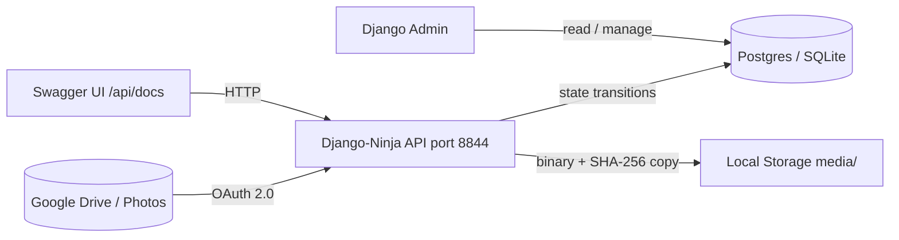
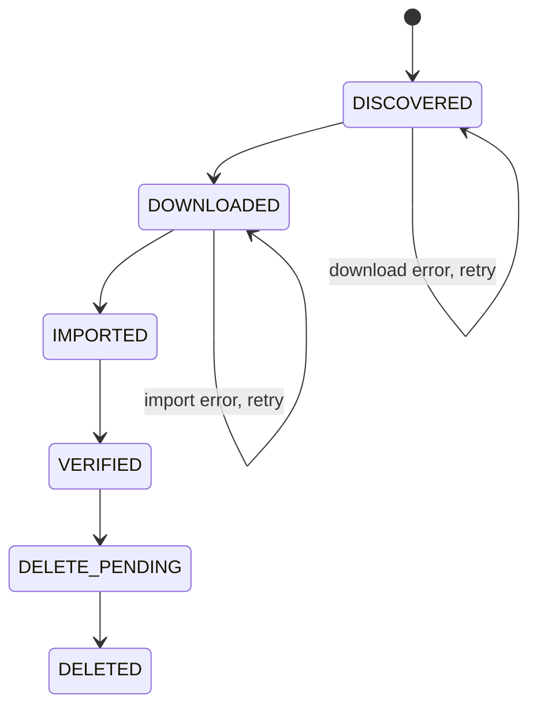
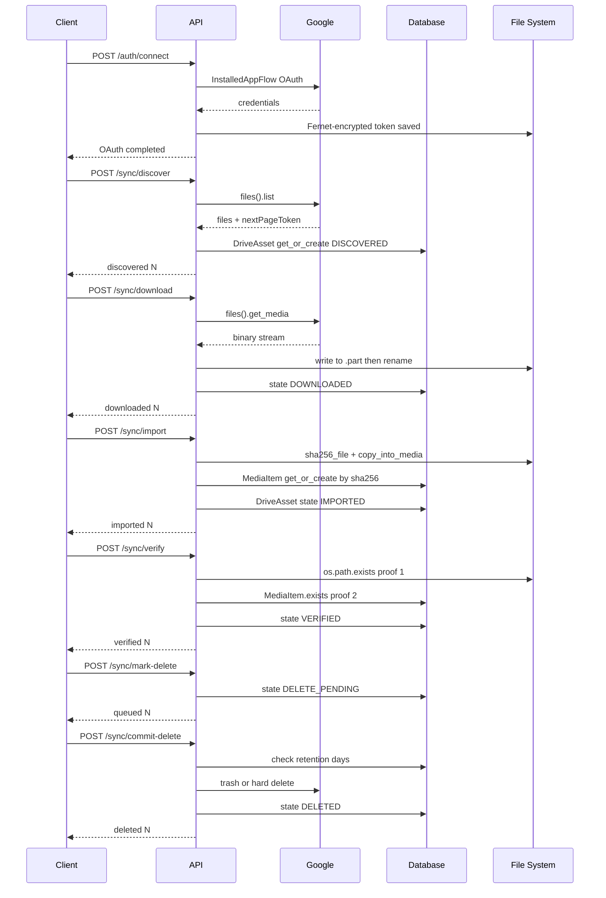
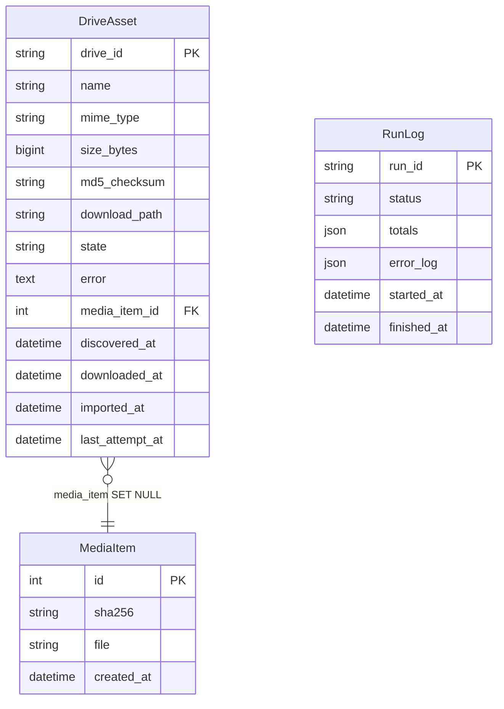
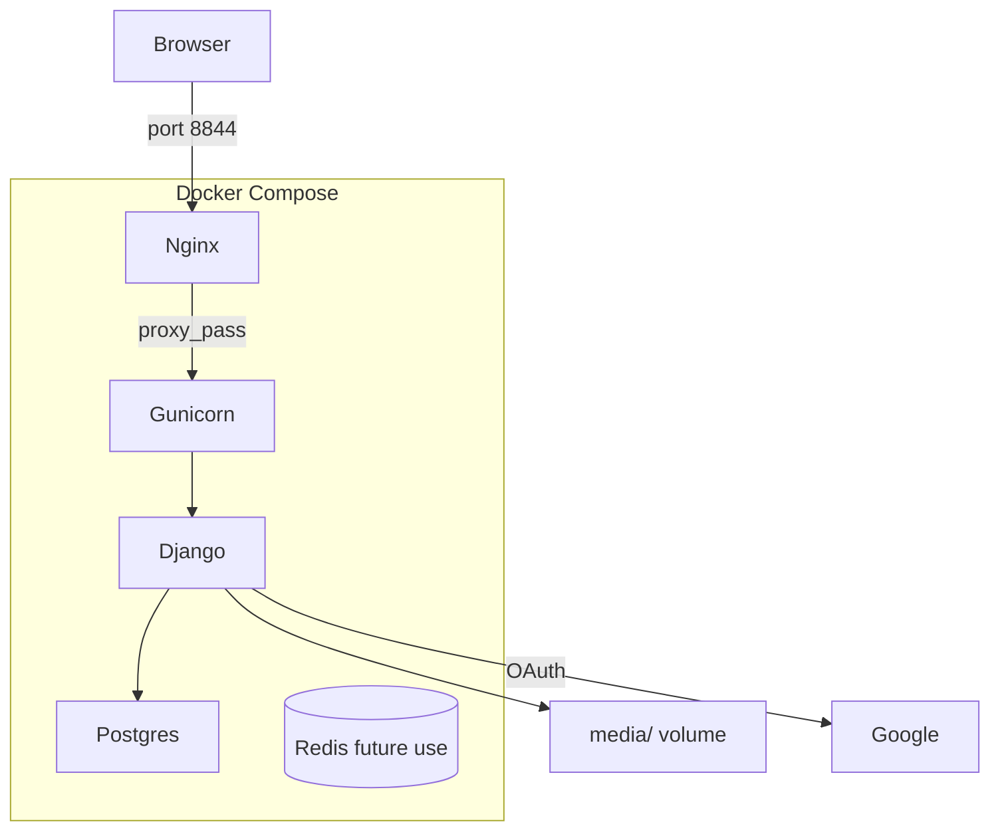

# Architecture

---

## System overview

BackDeezUp is an API-first Django application. The Django-Ninja layer is the primary interface; Django Admin provides a secondary ops console for browsing and managing state.

---

## Pipeline state machine

Every `DriveAsset` row progresses through exactly six states. No state can be skipped. Each API endpoint only processes assets in its expected input state.

| State | Meaning | Set by |
|---|---|---|
| `DISCOVERED` | Found in Drive/Photos, not yet downloaded | `/sync/discover*` |
| `DOWNLOADED` | Binary file on disk at `download_path` | `/sync/download` |
| `IMPORTED` | SHA-256 computed, copied to `media/imported/`, `MediaItem` created | `/sync/import` |
| `VERIFIED` | Both proofs confirmed | `/sync/verify` |
| `DELETE_PENDING` | Queued for Drive deletion | `/sync/mark-delete` |
| `DELETED` | Removed from Drive (trash or hard) | `/sync/commit-delete` |

---

## Two-proof deletion guard

Before any file is deleted from Google Drive, the system independently verifies:

1. **Disk proof** — `os.path.exists(download_path)` returns `True`
2. **Database proof** — `MediaItem.objects.filter(id=asset.media_item_id).exists()` returns `True`

If either check fails the asset stays in `DOWNLOADED`/`IMPORTED` and the error is recorded. Only assets where **both** proofs pass advance to `VERIFIED`.

---

## Full request / response sequence

---

## Data model

---

## Deployment topology

---

## Key files

| File | Responsibility |
|---|---|
| `google_media_backup/models.py` | `DriveAsset`, `MediaItem`, `RunLog` |
| `google_media_backup/api.py` | All Ninja endpoints — pipeline logic |
| `google_media_backup/services_google.py` | Google API client, OAuth, Fernet token I/O |
| `google_media_backup/utils.py` | `sha256_file`, `deterministic_path`, `copy_into_media`, `get_fernet` |
| `google_media_backup/admin.py` | Django admin + ops console link |
| `config/settings.py` | All settings via python-decouple |
| `docker-compose.yml` | Postgres + Redis + Gunicorn + Nginx |

---

## Critical invariants

- **Never skip a state.** Each endpoint only processes its expected input state.
- **SHA-256 is the dedup key.** Two Drive files with identical content produce one `MediaItem`.
- **`photos:` prefix.** Google Photos IDs stored as `photos:<id>` to avoid collision with Drive IDs.
- **Atomic download.** Files written to `<path>.part` then `os.replace()` — no partial files reach `DOWNLOADED`.
- **Retention guard is not bypassable without `force=true`.** Even then, `DRIVE_DELETE_MODE=trash` is the safe default.
- **`GOOGLE_ENCRYPTION_KEY` must be persisted.** Losing it makes the OAuth token unreadable.
