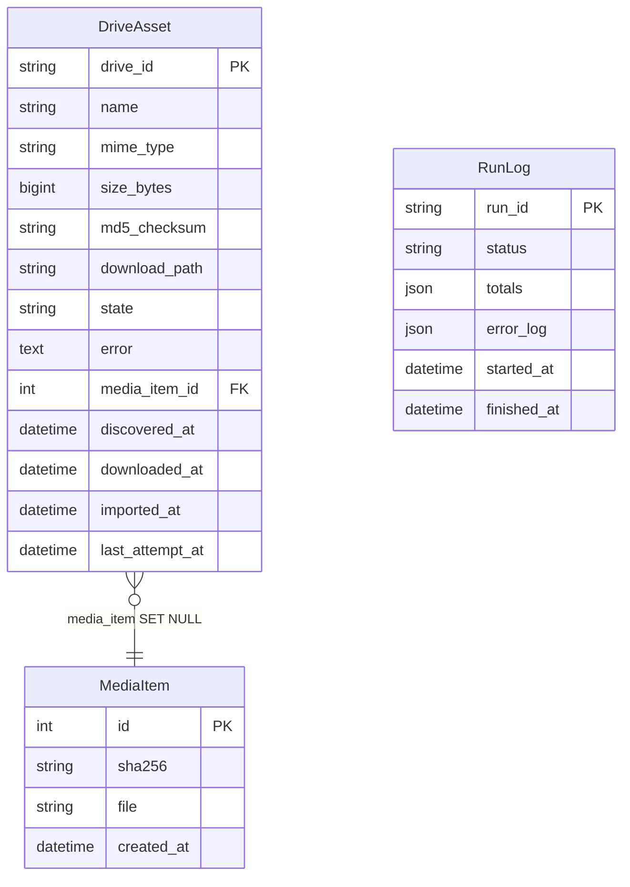

# Data Model

---

## Entity relationship diagram

---

## DriveAsset

One row per Google Drive or Google Photos item discovered. This is the primary tracking record for the pipeline.

| Field | Type | Description |
|---|---|---|
| `drive_id` | `CharField(256)` PK | Unique Google Drive file ID. Photos items use `photos:<id>` prefix. |
| `name` | `CharField(512)` | Original file name. |
| `mime_type` | `CharField(128)` | Google MIME type (e.g. `image/jpeg`). |
| `size_bytes` | `BigIntegerField` | File size in bytes as reported by Drive. |
| `md5_checksum` | `CharField(64)` | MD5 checksum from Drive metadata (nullable). |
| `download_path` | `TextField` | Absolute local path where the binary was downloaded. |
| `state` | `CharField(16)` | Current pipeline state. See [State Machine](states.md). |
| `error` | `TextField` | Last error message, if any. |
| `media_item` | FK to `MediaItem` | Set after import. `SET NULL` on `MediaItem` deletion. |
| `discovered_at` | `DateTimeField` | When the asset was first discovered. |
| `downloaded_at` | `DateTimeField` | When the binary download completed. |
| `imported_at` | `DateTimeField` | When the SHA-256 copy was created. Used for retention guard. |
| `last_attempt_at` | `DateTimeField` | Timestamp of the last processing attempt. |

---

## MediaItem

Deduplicated local file records. Two Drive files with identical content produce a single `MediaItem` — the SHA-256 hash is the deduplication key.

| Field | Type | Description |
|---|---|---|
| `id` | `BigAutoField` PK | Auto-incrementing integer. |
| `sha256` | `CharField(64)` unique | SHA-256 hex digest of the file content. The dedup key. |
| `file` | `FileField` | Relative path within `MEDIA_ROOT`, stored as `imported/<sha[:2]>/<sha>.ext`. |
| `created_at` | `DateTimeField` | When this record was first created. |

---

## RunLog

Audit trail for each pipeline API call. One record per invocation.

| Field | Type | Description |
|---|---|---|
| `run_id` | `CharField(64)` PK | UUID generated per API call. |
| `status` | `CharField(32)` | `RUNNING`, `OK`, or `ERROR`. |
| `totals` | `JSONField` | Counts of affected assets per state transition. |
| `error_log` | `JSONField` | List of error messages encountered during the run. |
| `started_at` | `DateTimeField` | When the run started. |
| `finished_at` | `DateTimeField` | When the run completed (null while running). |

---

## Notes

- `drive_id` for Google Photos items uses the `photos:` prefix to prevent ID collisions with Drive items (both use the same model).
- `MediaItem.sha256` is a database-level unique constraint — concurrent imports of the same file are safe via `get_or_create`.
- `DriveAsset.media_item` uses `SET NULL` on deletion so removing a `MediaItem` doesn't cascade-delete the Drive tracking record.
