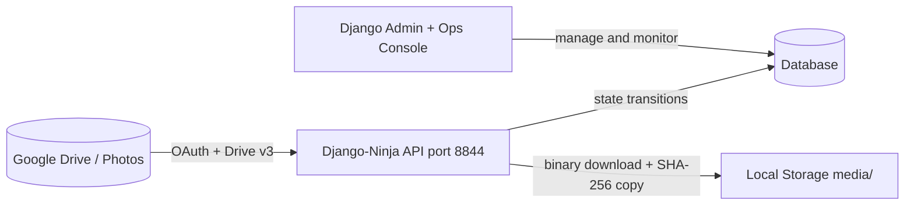
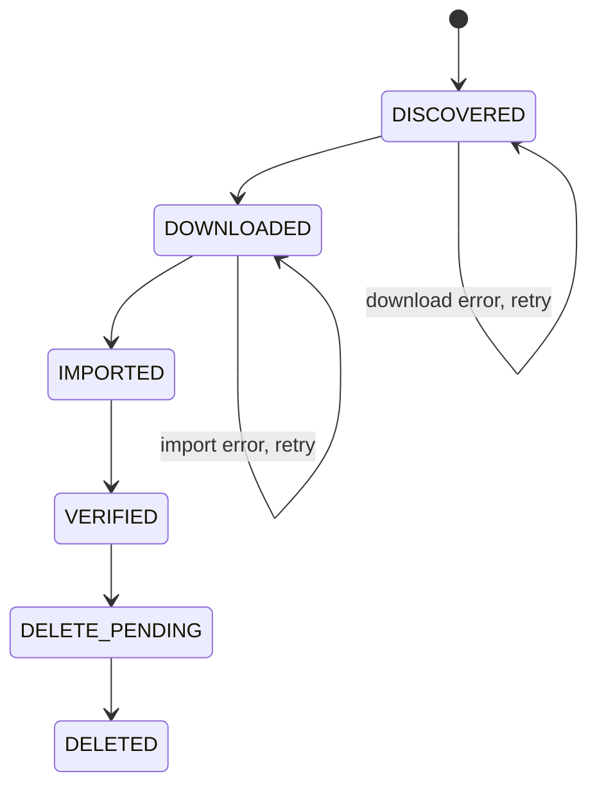
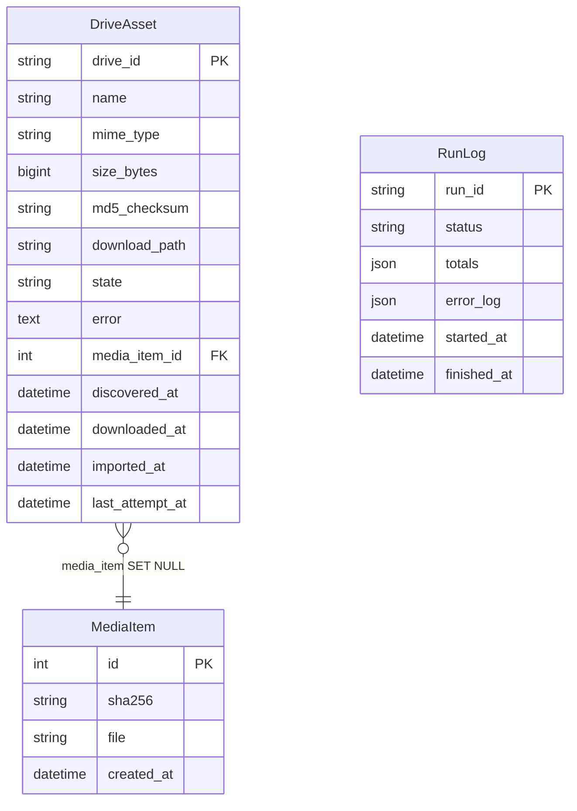
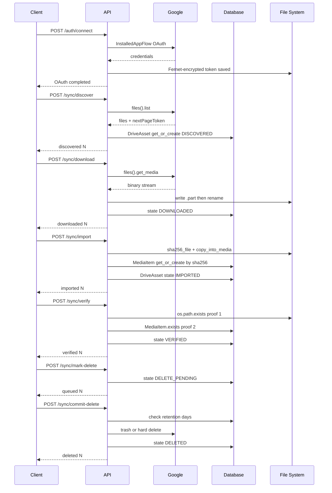
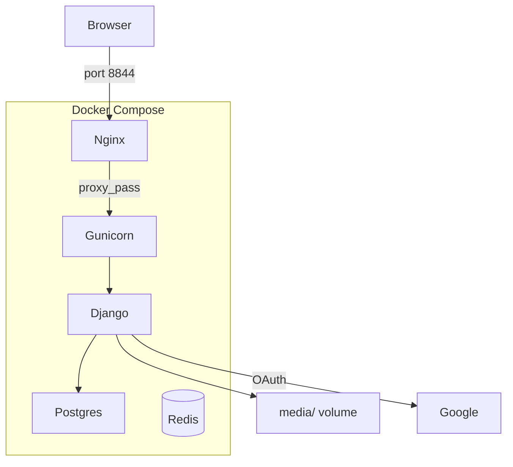

# Handover & Architecture

> Last updated: 2026-05-13 (v0.2.0)

This document is the canonical reference for anyone (human or AI agent) picking up this codebase. It covers architecture, invariants, and operational context.

---

## What this system does

**BackDeezUp** is a backend-first pipeline that safely migrates media from Google Drive / Google Photos into local Django-managed storage, then deletes the originals from Drive only after two independent proofs of local safety are confirmed.

**Two proofs required before any Drive delete:**

1. Local file exists at `download_path` on disk
2. A `MediaItem` row exists in the database (keyed by SHA-256)

---

## System overview

---

## Pipeline state machine

Each `DriveAsset` row moves through exactly these states. No state can be skipped.

---

## Data model

---

## Full request / response sequence

---

## Deployment topology

---

## Key files

| File | Responsibility |
|---|---|
| `google_media_backup/models.py` | `DriveAsset`, `MediaItem`, `RunLog` |
| `google_media_backup/api.py` | All Ninja endpoints |
| `google_media_backup/services_google.py` | Google API client, OAuth, Fernet token I/O |
| `google_media_backup/utils.py` | `sha256_file`, `deterministic_path`, `copy_into_media`, `get_fernet` |
| `google_media_backup/admin.py` | Django admin + ops console link |
| `config/settings.py` | All settings via python-decouple |
| `docker-compose.yml` | Postgres + Redis + Gunicorn + Nginx |
| `shared_context.md` | AI agent coordination — keep in sync |
| `pyproject.toml` | Dependencies + build config (uv / PEP 621) |

---

## Critical invariants

- **Never skip a state.** Each endpoint only processes its expected input state.
- **SHA-256 is the dedup key.** Two Drive files with identical content produce one `MediaItem`.
- **`photos:` prefix.** Google Photos IDs stored as `photos:<id>` to prevent Drive ID collision.
- **Atomic download.** Files written to `<path>.part` then `os.replace()` — no partial files reach `DOWNLOADED`.
- **Retention guard.** `MIN_RETENTION_DAYS` enforced unless `force=true` is explicitly passed.
- **`GOOGLE_ENCRYPTION_KEY` must be persisted.** Losing it makes the OAuth token unreadable.
