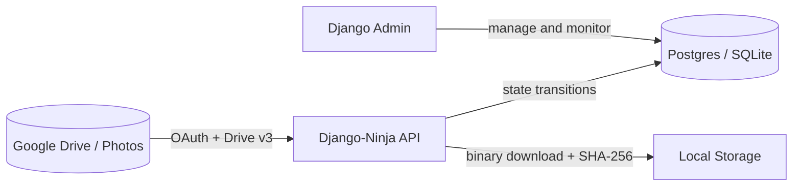
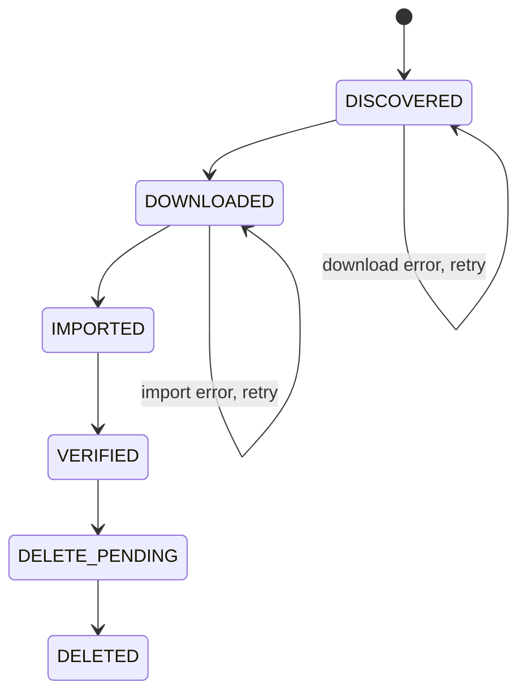

# BackDeezUp

**A backend-first pipeline that safely migrates media from Google Drive / Google Photos into local storage — with a provable audit trail and a two-proof deletion guard.**

---

## What it does

BackDeezUp connects to your Google account via OAuth, discovers all your media files, downloads and hashes them locally, and only removes them from Google Drive after confirming two independent proofs of local safety:

1. The file physically exists on disk
2. A database record (`MediaItem`) has been created, keyed by SHA-256

No file is ever deleted from Drive unless you can prove you have a valid local copy.

---

## Key features

- **Six-stage explicit pipeline** — DISCOVERED → DOWNLOADED → IMPORTED → VERIFIED → DELETE_PENDING → DELETED. No stage can be skipped.
- **Two-proof deletion guard** — disk presence + database record both required before Drive removal.
- **SHA-256 deduplication** — two Drive files with identical content produce one local copy.
- **Configurable deletion mode** — `trash` (recoverable) or `hard` (permanent). Default is `trash`.
- **Retention guard** — assets must be held locally for at least `MIN_RETENTION_DAYS` before deletion fires.
- **Django Admin ops console** — browse, filter, and manage assets from a web UI.
- **Full REST API** — all pipeline steps callable programmatically, Swagger docs at `/api/docs`.
- **Docker-ready** — Compose stack with Postgres, Nginx, and Gunicorn.

---

## Architecture

---

## Pipeline

---

## Quick navigation

| Goal | Page |
|---|---|
| Get up and running fast | [Quick Start](quickstart.md) |
| Configure environment variables | [Configuration](configuration.md) |
| Understand the pipeline | [Architecture](architecture.md) |
| Browse the API | [API Reference](api.md) |
| Deploy with Docker | [Deployment](deployment.md) |
| Contribute | [Contributing](contributing.md) |

---

Current release: **v0.2.0** — see [Changelog](changelog.md)
