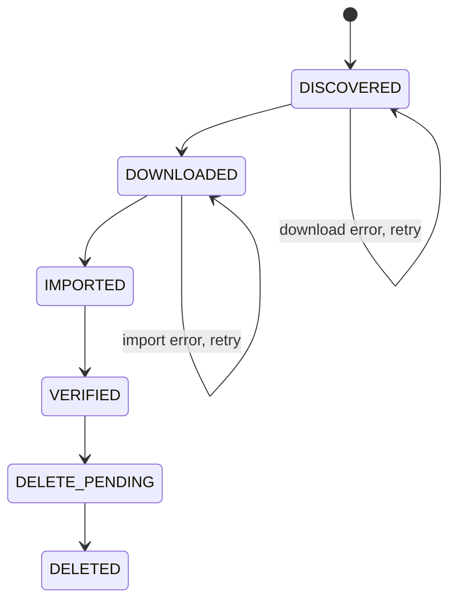
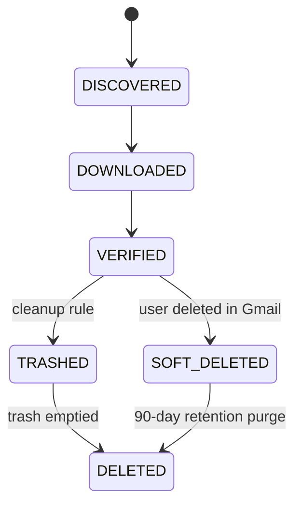

# State Machine

Every `DriveAsset` row moves through exactly six states. No state can be skipped, and only the designated endpoint advances each transition.

---

## State diagram



---

## State reference

### DISCOVERED

The asset has been found in Google Drive or Google Photos. Metadata is stored but no file has been downloaded yet.

**Set by:** `POST /sync/discover`, `/sync/discover-files`, `/sync/discover-photos`

**Stored:** `drive_id`, `name`, `mime_type`, `size_bytes`, `md5_checksum`, `discovered_at`

---

### DOWNLOADED

The binary file has been downloaded to local disk at `download_path`. The download is atomic — written to `<path>.part` first, then renamed.

**Set by:** `POST /sync/download`

**Stored:** `download_path`, `downloaded_at`

**Error handling:** If the download fails, `error` is recorded and the asset stays in `DISCOVERED` for retry.

---

### IMPORTED

The file has been SHA-256 hashed and copied into the media library at `media/imported/<sha[:2]>/<sha>.ext`. A `MediaItem` record has been created (or reused if the hash already exists — deduplication).

**Set by:** `POST /sync/import`

**Stored:** `media_item` FK, `imported_at`

---

### VERIFIED

Both proofs of local safety have been independently confirmed:

1. `os.path.exists(download_path)` — file exists on disk
2. `MediaItem.objects.filter(id=media_item_id).exists()` — DB record exists

**Set by:** `POST /sync/verify`

**Error handling:** If either proof fails the asset stays in `IMPORTED` and the error is recorded.

---

### DELETE_PENDING

The asset is queued for Drive deletion. The retention guard check has not yet been applied.

**Set by:** `POST /sync/mark-delete`

---

### DELETED

The file has been removed from Google Drive. The local copy remains intact.

**Set by:** `POST /sync/commit-delete`

**Conditions:**
- `(now - imported_at).days >= MIN_RETENTION_DAYS` must be true, or `force=true` must be passed
- Deletion mode is controlled by `DRIVE_DELETE_MODE` (`trash` or `hard`)

---

## Retention guard

The retention guard prevents premature deletion. By default an asset must be held locally for at least **3 days** from `imported_at` before `commit-delete` will act on it.

```
MIN_RETENTION_DAYS=3  # default, configurable in .env
```

Override per request with `?force=true` (use with caution).

---

## Deletion modes

| Mode | Behaviour | Recoverable |
|---|---|---|
| `trash` (default) | Moves file to Google Drive trash | Yes — 30 days |
| `hard` | Permanently deletes from Google Drive | No |

Set via `DRIVE_DELETE_MODE` in `.env`.

---

## Gmail Message States

Gmail messages go through a separate state machine:

DISCOVERED → DOWNLOADED → VERIFIED → TRASHED → SOFT_DELETED → DELETED

### State diagram



### State reference

| State | Meaning |
|-------|---------|
| DISCOVERED | Message ID found in Gmail, not yet downloaded |
| DOWNLOADED | .eml file saved to disk |
| VERIFIED | .eml file confirmed on disk with SHA-256 |
| TRASHED | Moved to Gmail trash by cleanup rule |
| SOFT_DELETED | Gone from Gmail (user deleted or trash emptied), .eml backup retained |
| DELETED | Purged from DB after 90-day retention period, metadata preserved in snapshot |

### Notes

- **SOFT_DELETED retention** — messages are kept for 90 days, then purged to DELETED
- **metadata_snapshot** — JSON field freezes subject/from/to/date/labels/size at deletion time
- **Restore-to-Gmail** — possible from SOFT_DELETED if .eml file still exists on disk
