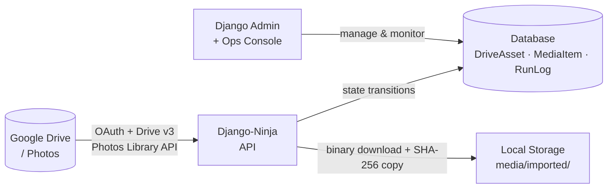
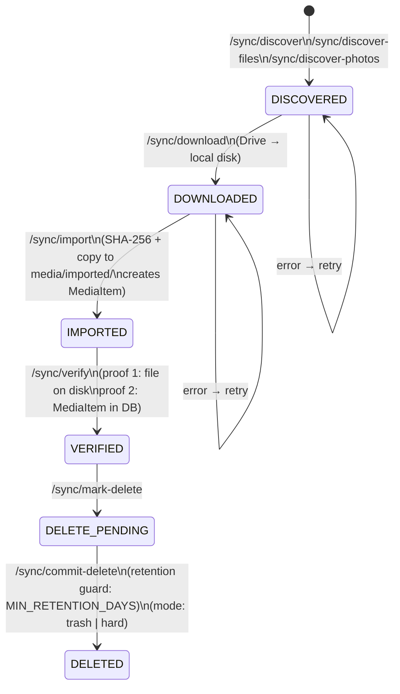
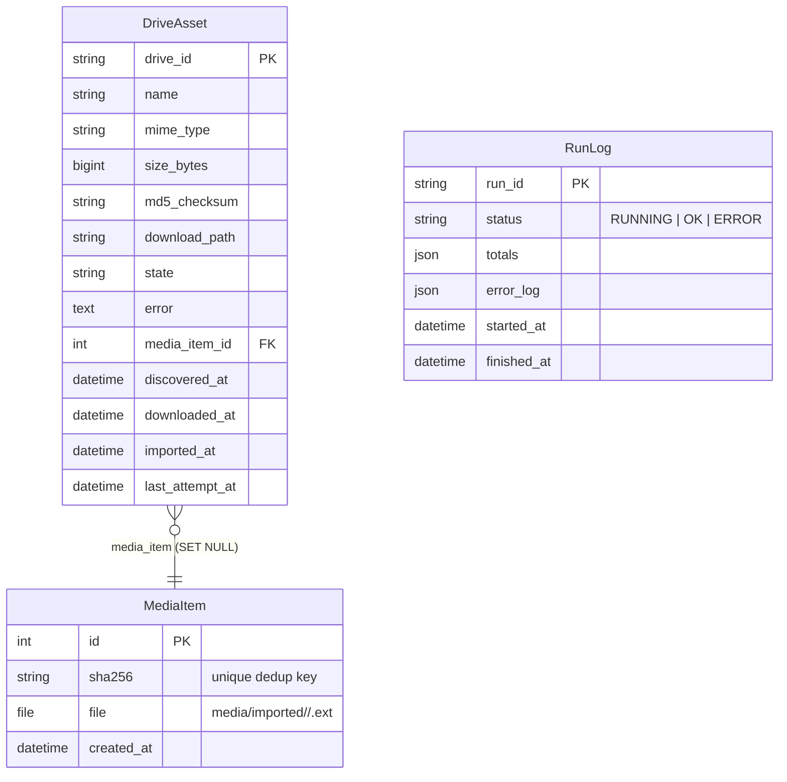
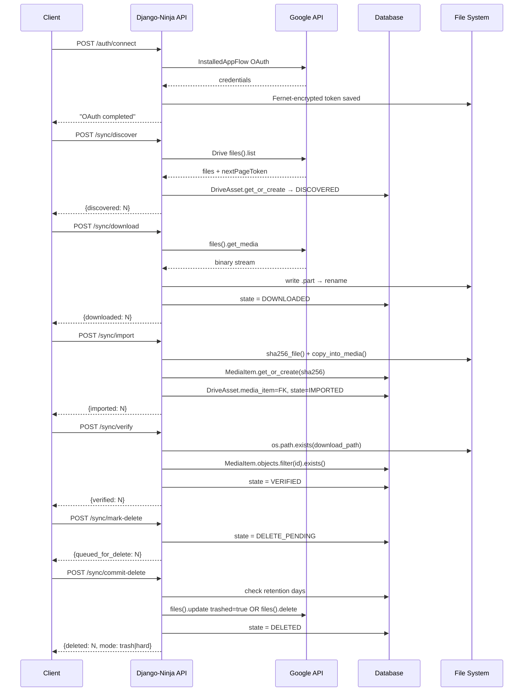

# shared_context.md
> Shared ground truth for Claude, Gemini, and Codex working on this repo.
> Keep this file updated as the project evolves.
> Last updated: 2026-05-13 (v0.3.0)

---

## What this project does

**backdeezup** is a backend-first pipeline that safely migrates media (photos, videos, documents) from a user's Google Drive / Google Photos into a local Django-managed storage, with a provable audit trail and a two-proof deletion guard before removing anything from Drive.

**Two proofs required before delete:**
1. The local file exists on disk
2. The file is recorded as a `MediaItem` in the database

---

## Data flow diagrams

### System overview



### State machine



### Data model (ER)



### Request/response sequence



---

## Tech stack

| Layer | Choice |
|---|---|
| Backend | Django 6.0+ |
| API | Django-Ninja 1.6+ (FastAPI-style, auto Swagger at `/api/docs`) |
| DB (dev) | SQLite (`db.sqlite3`) |
| DB (prod) | PostgreSQL 16 (via Docker Compose) |
| Google auth | `google-auth-oauthlib`, OAuth token encrypted with Fernet |
| File crypto | `cryptography.Fernet` (key = `GOOGLE_ENCRYPTION_KEY` env var) |
| Serving | Gunicorn + Whitenoise + Nginx |
| Docs | MkDocs Material (GitHub Pages via `.github/workflows/gh-pages.yml`) |
| Containerization | Docker Compose (web + nginx + postgres + redis) |
| Linting | pre-commit |
| **Package Manager** | **uv (Rust-based, 10-100x faster than pip)** |
| **Config** | **pyproject.toml (PEP 621)** |
| **Versioning** | **Semantic Versioning (CHANGELOG.md + VERSION file)** |
| **Docs** | **MkDocs Material — deployed to GitHub Pages via Actions** |
| **Browser tests** | **Playwright (pending — blocked by nested virt setup)** |

---

## Domain model

```
DriveAsset ──FK──> MediaItem
```

**`DriveAsset`** — one row per Google Drive / Photos item discovered.
Fields: `drive_id`, `name`, `mime_type`, `size_bytes`, `md5_checksum`, `download_path`, `state`, `error`, `media_item` (FK), timestamps.

**`MediaItem`** — deduplicated local file, keyed by `sha256`.
Fields: `sha256` (unique), `file` (FileField → `imported/`), `created_at`.

**`RunLog`** — audit log for each pipeline run.
Fields: `run_id`, `status`, `started_at`, `finished_at`, `totals` (JSON), `error_log` (JSON).

---

## State machine

```
DISCOVERED → DOWNLOADED → IMPORTED → VERIFIED → DELETE_PENDING → DELETED
```

| State | Meaning |
|---|---|
| `DISCOVERED` | Found in Drive/Photos, not yet downloaded |
| `DOWNLOADED` | Binary on disk at `download_path` |
| `IMPORTED` | SHA-256 computed, copied to `media/imported/`, `MediaItem` created |
| `VERIFIED` | Both proofs confirmed (file on disk + MediaItem in DB) |
| `DELETE_PENDING` | Queued for Drive deletion (retention guard applies) |
| `DELETED` | Removed from Drive (trash or hard, per `DRIVE_DELETE_MODE`) |

**Retention guard:** `MIN_RETENTION_DAYS` (default: 3). An asset must be at least this many days old (from `imported_at` or `discovered_at`) before `commit-delete` acts on it.

---

## API endpoints (`/api`)

| Method | Path | Purpose |
|---|---|---|
| `POST` | `/auth/connect` | Launch local OAuth flow, save encrypted token |
| `POST` | `/sync/discover` | Page through Drive images/videos, create `DriveAsset` rows |
| `POST` | `/sync/discover-files` | Same but for PDF, Office, archives, iWork docs |
| `POST` | `/sync/discover-photos` | Page through Google Photos Library (`photos:<id>` prefix) |
| `POST` | `/sync/download?limit=20` | Download `DISCOVERED` assets to local disk |
| `POST` | `/sync/import?limit=20` | SHA-256, copy to `media/imported/`, create `MediaItem` |
| `POST` | `/sync/verify?limit=50` | Confirm both proofs, advance to `VERIFIED` |
| `POST` | `/sync/mark-delete?limit=100` | Advance `VERIFIED` → `DELETE_PENDING` |
| `POST` | `/sync/commit-delete?force=false&limit=50` | Execute Drive deletion respecting retention guard |
| `GET` | `/assets?state=&q=` | List assets with optional state/name filter |

Swagger UI: `/api/docs`

---

## Key files

| File | Role |
|---|---|
| `backend_django/google_media_backup/models.py` | Django models: `DriveAsset`, `MediaItem`, `RunLog` |
| `backend_django/google_media_backup/api.py` | All Ninja API endpoints |
| `backend_django/google_media_backup/services_google.py` | Google Drive / Photos API wrappers, OAuth, Fernet token storage |
| `backend_django/google_media_backup/utils.py` | `sha256_file`, `deterministic_path`, `copy_into_media`, `get_fernet` |
| `backend_django/google_media_backup/admin.py` | Django admin with custom ops link |
| `backend_django/google_media_backup/admin_ops.py` | Staff-only operations console view |
| `backend_django/config/settings.py` | Django settings (all config via `python-decouple` + `.env`) |
| `docker-compose.yml` | Full stack: web + nginx + postgres + redis |
| `secrets/google_client.json` | Google OAuth client credentials (not committed in prod) |
| `secrets/google_token.json` | Encrypted OAuth token (Fernet-wrapped) |
| **`pyproject.toml`** | **Project config, dependencies, build settings (PEP 621)** |
| **`uv.lock`** | **Dependency lock file (managed by uv)** |
| **`dev.sh` / `dev.ps1`** | **Developer helper scripts (migrate, dev, test, etc.)** |
| **`CHANGELOG.md`** | **Release notes following Keep a Changelog format** |
| **`VERSION`** | **Current semantic version** |
| **`docs/project-comparison.md`** | **Feature comparison with Gmail cleanup project + roadmap** |
| **`docs/index.md` + 9 more pages** | **Full MkDocs documentation suite (v0.3.0)** |

---

## Important env vars

| Var | Default | Notes |
|---|---|---|
| `GOOGLE_CLIENT_SECRETS` | `secrets/google_client.json` | Path to OAuth client JSON |
| `GOOGLE_TOKEN_FILE` | `secrets/google_token.json` | Path for encrypted token |
| `GOOGLE_ENCRYPTION_KEY` | random (insecure) | 44-char Fernet key — set explicitly in prod |
| `GOOGLE_MIME_ALLOWLIST` | `image/jpeg` | Comma-separated MIME filter |
| `DRIVE_DELETE_MODE` | `trash` | `trash` or `hard` |
| `MIN_RETENTION_DAYS` | `3` | Minimum days before commit-delete fires |
| `DATABASE_URL` | SQLite fallback | Postgres URL in prod |
| `MEDIA_ROOT` | `backend_django/media` | Where imported files land |
| `DEBUG` | `False` | |

---

## Knowledge graph (graphify)

Built: 2026-05-12 — 86 nodes · 104 edges · 24 communities.
God nodes (most connected): `drive_service()`, `MediaItem`, `DriveAsset`, `RunLog`, `AssetOut`.
Refresh after code changes: `graphify update .`
Graph output: `graphify-out/` (graph.json, graph.html, GRAPH_REPORT.md)

---

## Future Roadmap (see docs/project-comparison.md)

The project has been analyzed against a similar Gmail cleanup project. Key enhancements planned:

### Phase 1: Foundation (HIGH PRIORITY)
- Multi-account model (`GoogleAccount`) with scope tracking
- Enhanced audit logs (actor, action, affected_count, affected_bytes)
- DB-backed settings management

### Phase 2: Reporting & Dashboards
- Admin dashboard with stats, quota tracking, top file types
- Materialized views for file type/size/age analysis
- CSV/JSON export capabilities

### Phase 3: Cleanup Rules Engine
- `CleanupRule` model with query filters
- Cleanup boards (Large+Old, Video, Duplicates)
- Dry-run → Execute workflow with confirmation

### Phase 4: Advanced Features
- SHA-256 duplicate detection (field exists, need logic)
- Incremental sync using Drive `changes.list()` API
- Proxy generation (720p thumbnails/previews)

### Phase 5: Automation
- Scheduled sync & cleanup (OFF by default)
- Protected lists (never-delete file types/paths)
- Quota tracking with color-coded UI

**Current version: 0.3.0** | **Target: v1.0.0 after Phase 3 complete**

---

## Conventions for AI agents

- **One pipeline step at a time.** Each API call advances exactly one state transition.
- **Never skip a state.** Deletion requires VERIFIED state; VERIFIED requires IMPORTED; etc.
- **SHA-256 is the dedup key.** `MediaItem.sha256` is unique — duplicate Drive files map to the same `MediaItem`.
- **`photos:` prefix.** Google Photos items use `drive_id = "photos:<id>"` to avoid collision with Drive IDs.
- **Settings via env.** All config is read via `python-decouple`; never hardcode.
- **Test DB is SQLite.** Use `DATABASE_URL` to point to Postgres in prod/Docker.
- **Graphify is installed for Claude, Gemini, and Codex.** Run `graphify update .` after any structural change so all agents stay in sync.
- **Use uv for dependencies.** Run `uv add <package>` to add dependencies (auto-updates pyproject.toml and uv.lock).
- **Use dev scripts.** Run `./dev.sh <command>` (Bash) or `.\dev.ps1 <command>` (PowerShell) for common tasks.
- **Update CHANGELOG.md.** Add changes under `[Unreleased]` section as you work. Move to versioned section on release.
- **Semantic versioning.** Follow semver: MAJOR.MINOR.PATCH (breaking.feature.fix).
- **Git user: devadalberto.** Local repo configured for devadalberto@gmail.com.
- **Private GitHub repo.** Located at https://github.com/devadalberto/backdeezup (private).
- **Docs site.** MkDocs Material deployed to GitHub Pages on every push to main. 10 pages covering quickstart, config, architecture, API, deployment, contributing, changelog, acknowledgements.
- **Mermaid diagrams.** All diagrams use plain ASCII/GitHub-compatible syntax. No `\n` in node labels, no Unicode arrows. Required for GitHub renderer.
- **Server: WINWEB01.** Windows Server 2025, itself a Hyper-V VM. Nested virtualization not yet enabled — Claude sandbox and WSL2 distros blocked until host enables `ExposeVirtualizationExtensions`. Playwright browser automation works without this fix.
- **Playwright (next).** Browser automation for testing planned. `uv add playwright` + `playwright install chromium` works on Windows without nested virt.
